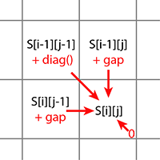

# Introduction
This week we will be implementing Smith-Waterman. This is a dynamic programming algorithm used for local sequence alignment. 

As a reminder, the scoring for Smith-Waterman only uses the scores from the positions above, left, and above-left of the current position in the matrix as below:

<center></center>

For traceback, you will need to keep track of the direction of the arrows in a matrix and then begin traceback from the maximum value.

# Smith-Waterman Algorithm Implementation Activity
## Introduction

Pairwise sequence alignment is a fundamental technique in bioinformatics used to compare two biological sequences, such as DNA, RNA, or proteins. It helps identify regions of similarity that may indicate functional, structural, or evolutionary relationships between the sequences.

The brute force method for sequence alignment, which involves comparing every possible alignment, is highly inefficient. For two sequences of length m and n, the time complexity would be \(T(m,n) = O(mn \cdot 2^{m+n})\), making it impractical for longer sequences.

Dynamic programming offers a more efficient solution. It breaks down the problem into smaller subproblems and stores their solutions to avoid redundant computations. This approach reduces the time complexity to \(O(mn)\).

The Smith-Waterman algorithm is a dynamic programming approach for local sequence alignment. It identifies the optimal local alignment between two sequences by comparing all possible pairs of segments from the sequences and finding the best-scoring alignment.

# Pseudocode
Put pseudocode in this box:

```
## global values:
END = 0
DIAG = 1
UP = 2
LEFT = 3

## Data structures:
Our matrix_struct will contain:
    H/scores: np.array (n x m) of column segment size m (indexed by "i") and 
          row segment size n (indexed by "j") of int that contain the scores for the matrix
          
    direction: np.array (n x m) that indicates direction where max "score" came from (integer 1-3, can be DIAG,UP,LEFT)
    
    Start_trace/Max_value: isn't this going to be the value in matrix[col_n,row_m]?  
         No -- it could be max value in matrix[col_n,0:row_m] or
                max value of matrix[0:col_n,row_m] if we were matching subset strings?
    
There will be another structure that contains the alignment path (traceback_matrix):
it will be indexed by "k"
alignment_path is an array of structures that contain:
    pos = position into matrix array where:(i,j) = pos[0],pos[1]
    dir = direction from where score came from can be UP,LEFT,DIAG
    scr = alignment score at current position in the path

## Follow these steps:

### Implement the scoring matrix calculation function:

smith_waterman (matrix, seq1, seq2, mismatch_penalty, gap_penalty)

    seq1 = column (vertical) 
    seq2 = row (horizontal)
    final_score = 0
    final_score_pos = [0,0]
    
    matrix -- initialize with zeros -- (matrix [0:n][0:m])
    
    n = len(seq1)
    m = len(seq2)
    for i 0 to n:
        for j to m:
            new_score = cal_score(matrix, seq1, seq2, i, j, mismatch_penalty, gap_pentalty) 
            if final_score < new_score) 
                final_score = new_score
                final_score_pos = [i, j]
                
    return(matrix, final_score_pos[0],final_score_pos[1])
    

1. Initialize the matrix with zeros
2. Fill the matrix using the Smith-Waterman algorithm
3. Return the completed matrix and the position of the highest score

### Implement the traceback function

1. Start from the highest score position
2. Trace back through the matrix to reconstruct the optimal alignment
3. Return the aligned sequences and the alignment score

def max_score(matrix)

    len(matrix). -- need n and m
    
    max_value = 0
    
    for i 0 to n
        for j 0 to m    
            cur = current_value(matrix[i][j])
            if max_value < cur: max_value = max(matrix(row))
        
    return(max_value, i, j)

## Implement traceback

def traceback (seq1, seq2, matrix, maximum_position)
     '''Find the optimal path through scoring marix
        
        diagonal: match/mismatch
        up: gap in seq1
        left: gap in seq2
        
    Args:
        seq1 (str) : First sequence being aligned
        seq2 (str) : Second sequence being aligned
        traceback_matrix (numpy array): traceback matrix
        
        maximum_position (tuple): starting position to trace back from
        
    Returns:
        aligned_seq1 (str): e.g. GTTGAC
        aligned_seq2 (str): e.g. GTT-AC
        
    Pseudocode:
        current_move = traceback_matrix[current_row][current_col]
        while current_move != END:
            if current_move == DIAG:
                align_seq1 += seq1[current_row] # adding one character!
                align_seq2 += seq2[current_col]
                current_row = current_row-1
                current_col = current_col-1
                
            elif current_move == UP:
                align_seq1 += seq1[current_row]
                align_seq2 += "-" # space here
                current_row = current_row-1
                
            elif current_move == LEFT:
                align_seq1 += "-" # space here
                align_seq2 += seq2[current_col]
                current_col = current_col-1
            current_move = traceback_matrix[current_row][current_col]
        
        return (align_seq1,align_seq2)
    ''' 

### Implement a main function that:

call smith_waterman with two sequences, it will return scoring matrix and two alignment sequences.
```

# Successes
We successfully implemented the Smith-Waterman algorithm for local sequence alignment. A key success was the correct implementation of the dynamic programming logic in the matrix-filling step. For each cell H[i,j], our cal_score function correctly calculated the score by taking the maximum value among four possibilities: a score of zero (for local alignment), or the scores derived from a diagonal move (match/mismatch), an upward move (gap), or a leftward move (gap). We also successfully kept track of the position of the highest score in the matrix, which served as the starting point for the traceback.

# Struggles
One of the most significant challenges we encountered was ensuring consistent handling of indices between the sequences and the scoring/traceback matrices. We spent a considerable amount of time clarifying the relationship between the row and column variables across our different functions.
Another struggle was correctly implementing the traceback logic. Since we built the aligned sequences by moving backward from the end of the alignment to its start, the resulting strings were in reverse order. 

# Personal Reflections
## Group Leader - Tiange
This project was an excellent practical exercise in understanding the power of dynamic programming. It was insightful to see how a complex problem like finding the best local alignment can be solved by breaking it down into a series of simple, recursive calculations at each cell in a matrix. Jackie's clear and efficient pseudocode served as an excellent theoretical map for our implementation. Translating it into functional code revealed the importance of careful attention to detail, particularly with "off-by-one" errors in indexing, as our matrix dimensions were len(seq) + 1. In summary, our collaboration was very smooth, enabling us to successfully complete the assignment while also pinpointing common sources of error.

## Other member - Jacque
This project was interesting because it made me look not only at Smith-Waterman algorithm, but start looking at optimizations on Smith-Waterman, and other techniques.  So many problems to overcome when looking for overlaps with DNA.  I do have to admit that this project freaked me out a bit, because I do not know my left from my right.  It just doesn't come naturally to me, I have to STOP and think about it, and I often have problems orienting column and rows.  So, what I decided to do, was to be regimented with how I was referring to indices into our matrixes, and ALWAYS referred to it as [columns][rows].  and the index i and length n were always associated with COLUMNS & seq1 and index j and length m were always associated with ROWS and seq2.  While I'm still not sure that the directionality of all the things is right, by being consistent it took a lot of the disorganization I feel when I see something saying left.   The memory-less-ness of this algorithm also helped me to start to see the local picture, without having to understand the whole global problem all at once.  I did notice that in larger Smith-Waterman score matrices, that most of the work of the matrix is done in a diagonal with little excursion around this diagonal, and when I was looking for more information on this on-line, I was pleased to see that there was some documentaion that there is an optimized version -- Banded Smith-Watermzan(1).  

## Other member - Little
Working with Tiange and Jackie was really great. The discussion surrounding the assignment and making sure everyone was on the same page of understanding was more than helpful. It helped us solidfy the understanding of the module and this course as a whole.
I think this algorithm was the simplest one we covered. I realized it is more maxtrix manipulation and sequencing alignment. I thought error tags should be added but realized it was not needed for this project. I do plan on applying this algorithm to a personal project
in order to get a role in the computational group.

# Generative AI Appendix

(1) Y. -L. Liao, Y. -C. Li, N. -C. Chen and Y. -C. Lu, "Adaptively Banded Smith-Waterman Algorithm for Long Reads and Its Hardware Accelerator," 2018 IEEE 29th International Conference on Application-specific Systems, Architectures and Processors (ASAP), Milan, Italy, 2018, pp. 1-9, doi: 10.1109/ASAP.2018.8445105.
